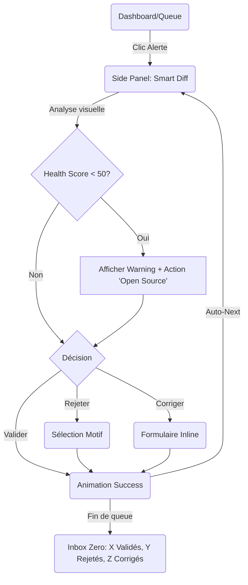
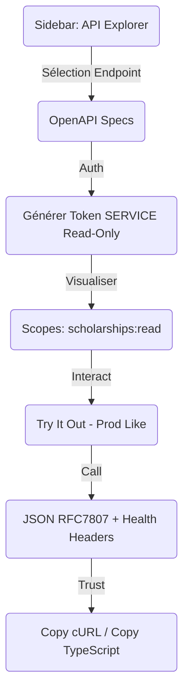
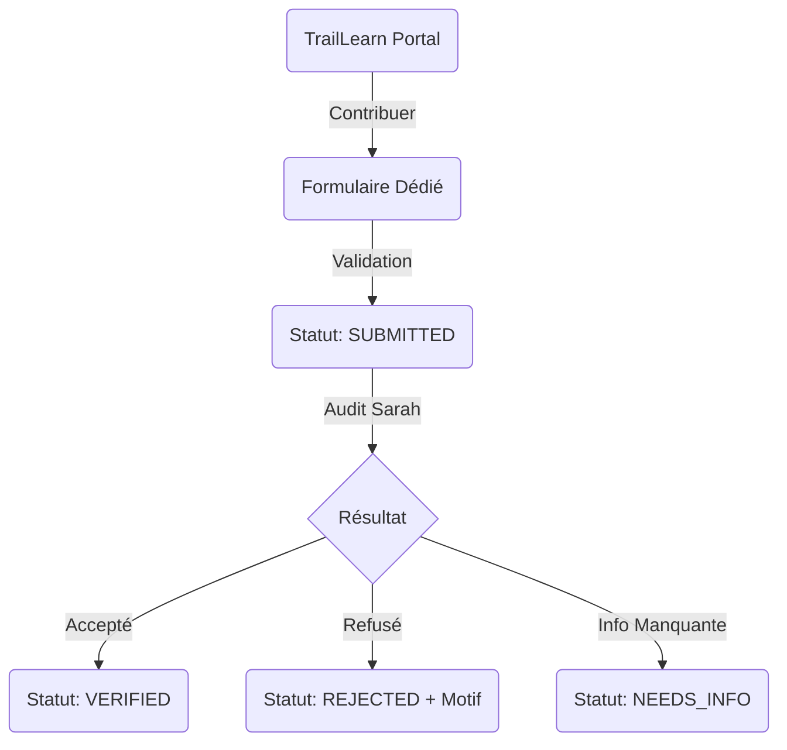

# UX Design Specification traillearn-data-provider-scholarships

**Author:** aubinaso
**Date:** Saturday, January 17, 2026

---

## Executive Summary

### Project Vision

Le Scholarship Data Provider est une "Oracle Factuelle" dont la mission est de centraliser et qualifier les aides financières étudiantes. Sa valeur repose sur la transparence radicale de l'incertitude via le "Minimum Viable Trust". Le système ne se contente pas de lister des bourses, il expose leur santé technique pour garantir une intégration sécurisée dans l'écosystème TrailLearn.

### Target Users

- **Marc (Développeur Core)** : Consommateur de l'API. Recherche la stabilité contractuelle et des métadonnées de confiance précises (`health_score`, `last_verified_at`) pour automatiser la consommation de données sans risque.
- **Sarah (Data Manager / Admin)** : Profil non-technique (Ops). Supervise la qualité des données via une interface desktop optimisée. Elle a besoin de comparaisons simplifiées ("Ancienne valeur" vs "Nouvelle valeur") pour valider ou rejeter les changements sans manipuler de code ou de HTML.
- **Thomas (Étudiant Contributeur)** : Expert terrain. Soumet des opportunités et attend un suivi sobre mais clair du statut de sa contribution (`SUBMITTED` -> `VERIFIED/REJECTED`).

### Key Design Challenges

- **Visualisation de la Confiance** : Transformer un score algorithmique complexe en indicateur visuel intuitif.
- **Gestion Ops non-technique** : Présenter les changements structurels de données externes de manière intelligible pour une gestionnaire non-développeuse (diffs sémantiques vs diffs techniques).
- **Dualité d'Interface** : Faire cohabiter dans un même outil (Sandbox) un explorateur technique d'API et une console de gestion opérationnelle.

### Design Opportunities

- **Sandbox Dual-Role** : Un environnement unique servant de démo d'intégration pour les devs et de centre de commande pour les ops, renforçant la cohérence des données.
- **Validation "Zero-Fatigue"** : Interface de gestion desktop privilégiant les vues split-screen et les actions rapides pour traiter la queue de tâches de Sarah en un minimum de clics.

## Core User Experience

### Defining Experience

L'expérience centrale repose sur la gestion de la confiance en temps réel. Pour le gestionnaire (Sarah), c'est une expérience de supervision assistée par intelligence (Change Detection). Pour le consommateur (Marc), c'est une expérience de consommation sécurisée. Le cœur du produit est la **boucle de validation des données critiques**. La Sandbox est explicitement un outil Ops & Démo, pas un produit utilisateur final. Toute vue doit répondre à la question : "Quelle décision humaine cela permet-elle de prendre, et en combien de temps ?"

### Platform Strategy

- **Web Desktop-First** : Interface d'administration optimisée pour la gestion de données massives. Utilisation de patterns "Dashboard" et "Task Queue". Priorité absolue à l'usage desktop (split views, tableaux).
- **Web Responsive Léger** : Pour Marc (consultation API) et Thomas (soumission), sans besoin d'application native.
- **Accessibilité & Sémantique** : Système de couleurs (Vert > 80, Orange 50-80, Rouge < 50) systématiquement doublé d'icônes et de textes explicatifs pour ne jamais dépendre uniquement de la couleur.

### Effortless Interactions

- **Smart Diffing** : Affichage automatique des champs modifiés uniquement (Ancien vs Nouveau), masquant le bruit des données inchangées. Sarah ne cherche jamais l'information, elle la reçoit structurée pour décider.
- **Quick Actions** : Boutons de validation/rejet accessibles via raccourcis clavier ou clics directs sans ouvrir de sous-menus.
- **Auto-Suggest** : Lors d'un rejet, proposer des motifs fréquents (ex: "Deadline passée", "Source invalide").

### Critical Success Moments

- **Détection de Changement Silencieuse** : Le système détecte une erreur 404, dégrade le score, et Sarah valide le changement avant même que Marc n'ait eu le temps de consommer une donnée erronée.
- **Onboarding Technique Instantané** : Marc effectue son premier appel API et comprend immédiatement la qualité de la donnée grâce aux métadonnées de confiance.
- **Flow State de Sarah** : Capacité à traiter une queue de 50 items en moins de 10 minutes grâce à l'optimisation cognitive de l'interface.

### Experience Principles

- **Transparence de l'Incertitude** : Si le système ne sait pas, il l'affiche clairement. Ne jamais cacher une faiblesse de donnée.
- **Cognition avant Action** : Présenter l'information de manière à ce que la décision humaine soit évidente et immédiate.
- **Score toujours expliqué** : Le chiffre du Health Score doit toujours être accompagné d'une raison littéraire (Raison > Chiffre).
- **Efficacité Opérationnelle** : Privilégier la rapidité de traitement des tâches répétitives sur la richesse fonctionnelle superflue.

## Desired Emotional Response

### Primary Emotional Goals

- **Sérénité Opérationnelle (Sarah)** : Transformer la gestion de données massives en une suite de décisions simples, calmes et maîtrisées.
- **Confiance Implicite (Marc)** : Éliminer la peur de l'erreur de donnée par une transparence totale et une fiabilité algorithmique.

### Emotional Journey Mapping

- **Entrée en matière** : Sentiment de professionnalisme et de robustesse technique.
- **Usage intensif** : Sentiment de fluidité et de haute productivité (Flow).
- **Gestion d'alerte** : Sentiment de soulagement (le système veille) plutôt que de panique.

### Micro-Emotions

- **Confiance renforcée** par la preuve (logs, timestamps).
- **Fierté de contribution** (pour Thomas) via la validation explicite.
- **Satisfaction du travail fini** via la vidange de la queue de tâches admin.

### Design Implications

- **Silence Visuel** : Interface minimaliste masquant la complexité technique pour ne révéler que l'essentiel.
- **Micro-interactions de Validation** : Feedback visuel clair et gratifiant lors d'une validation/rejet pour renforcer le sentiment d'accomplissement.
- **Langage de Vérité** : Utiliser des libellés clairs (ex: "Source hors-ligne" au lieu de "Error 500") pour humaniser la technique.

### Emotional Design Principles

- **Prove it to Trust it** : Pas de score sans explication.
- **Less is More Ops** : Moins d'informations à l'écran = plus de sérénité pour décider.
- **Human in the Loop** : Valoriser l'action humaine de validation comme l'acte ultime de qualité.

## UX Pattern Analysis & Inspiration

### Inspiring Products Analysis

- **Stripe Dashboard** : Référence pour la clarté des données financières et des logs API. Nous retenons la gestion des statuts via des badges colorés et la lisibilité des payloads.
- **GitHub Pull Request** : Standard pour la comparaison de données (Diffing). Nous adoptons la vue split-screen (Ancien vs Nouveau) pour la validation des bourses.
- **Vercel Dashboard** : Modèle de "Silence Visuel" et de minimalisme technique. Nous retenons l'usage d'une typographie forte et d'un espacement généreux pour réduire la charge cognitive.

### Transferable UX Patterns

- **Review Queue Pattern** : Organisation type "Boîte de réception" pour traiter les soumissions de Thomas et les alertes du Bot.
- **Semantic Diffing** : Transformation des données brutes en paires Clé/Valeur lisibles pour Sarah (ex: Dates formatées, montants avec devises).
- **Interactive API Documentation** : Pattern "Try it out" intégré pour permettre aux développeurs de tester immédiatement le Health Score.

### Anti-Patterns to Avoid

- **Pagination vs Infinite Scroll** : Utilisation exclusive de la pagination pour garantir que Sarah puisse suivre son avancement exact.
- **Icon-Only Navigation** : Interdiction des icônes sans labels explicites pour éviter toute ambiguïté opérationnelle.
- **Modale intrusive** : Privilégier les panneaux latéraux (Side Panels) pour garder le contexte de la liste lors de l'édition d'un item.

### Design Inspiration Strategy

- **Adopter** : Le pattern "Split View Diff" de GitHub et les badges de statut de Stripe.
- **Adapter** : Le code couleur des "Web Vitals" de Google pour le Health Score (Vert/Orange/Rouge).
- **Éviter** : La densité extrême de type "Feuille de calcul" au profit d'une interface aérée et hiérarchisée.

## Design System Foundation

### 1.1 Design System Choice

**Tailwind CSS + Shadcn/ui (React-based)**

### Rationale for Selection

- **Minimalisme Technique** : Permet d'atteindre l'esthétique "Silence Visuel" recherchée, alignée sur les standards de Vercel et Stripe, évitant la lourdeur visuelle des frameworks "Enterprise" classiques.
- **Flexibilité Totale** : Crucial pour implémenter des patterns non-standards comme le "Smart Diffing" sémantique et les jauges de "Health Score" sans combattre un framework rigide.
- **Onboarding Développeur** : Tailwind est le standard actuel pour les développeurs frontend, garantissant une adoption rapide et une maintenance aisée.
- **Accessibilité Native** : L'utilisation de Radix UI (via Shadcn) assure une accessibilité irréprochable (lecteurs d'écran, navigation clavier) sans effort supplémentaire.

### Implementation Approach

- **Utility-First & Layout** : Utilisation intensive des classes Tailwind pour le layout et le spacing afin de garantir la cohérence desktop (Split Views).
- **Component-Driven** : Création d'une bibliothèque de composants internes (Atomes/Molécules) basée sur les primitives de Shadcn, adaptée aux besoins Ops (Tableaux denses, Badges de statut).
- **Dark Mode Support** : Indispensable pour un outil de type "Sandbox/Console" utilisé quotidiennement par les Ops, afin de réduire la fatigue oculaire.

### Customization Strategy

- **Design Tokens** : Définition d'une palette de couleurs sémantiques stricte pour les scores (Success, Warning, Critical) et les statuts de bourses.
- **Typography** : Choix d'une police Sans-Serif hautement lisible et optimisée pour les chiffres (ex: Inter ou Geist) pour les données tabulaires massives.

## 2. Core User Experience

### 2.1 Defining Experience

**L'Audit de Confiance (The Trust Audit)**.
L'interaction centrale est la révision assistée par intelligence des changements de données. Le système agit comme un pré-processeur qui mâche le travail de comparaison, permettant à l'humain de se concentrer uniquement sur la décision finale de vérité.

### 2.2 User Mental Model

**Le Correcteur Augmenté**.
L'utilisateur aborde la tâche avec l'état d'esprit d'un éditeur validant des épreuves. Il s'attend à voir les différences mises en évidence (surlignées) et à disposer d'outils binaires simples (Oui/Non) pour trancher. Il déteste devoir "chercher l'erreur" lui-même.

### 2.3 Success Criteria

- **Time-to-Decision < 5s** : L'interface doit permettre de comprendre le changement et de cliquer en moins de 5 secondes par item.
- **Zéro Aller-Retour** : L'utilisateur ne doit jamais avoir besoin d'ouvrir un nouvel onglet ou de consulter une documentation externe pour comprendre un changement (sauf vérification source ultime).
- **Sentiment de Flow** : L'enchaînement des validations doit être fluide, sans temps de chargement perceptible entre deux items.

### 2.4 Novel UX Patterns

**Semantic Data Diffing**.
Adaptation du pattern "Code Diff" (GitHub) aux données métier.
*   **Innovation** : Comparaison intelligente qui comprend la sémantique (ex: changement de devise, changement de format de date) plutôt qu'une simple comparaison de chaînes de caractères.
*   **Visualisation** : Utilisation de la métaphore visuelle "Avant (Barré Rouge) / Après (Surligné Vert)" familière mais appliquée à des cartes de données.

### 2.5 Experience Mechanics

1.  **Trigger** : Apparition d'une tâche dans la "Review Queue" suite à une détection de changement par le worker.
2.  **Focus** : Sélection de la tâche ouvrant un panneau de détail (Side Panel) sans quitter la liste contextuelle.
3.  **Cognition** : Lecture instantanée du "Smart Diff" qui isole les champs modifiés.
4.  **Action** : Décision binaire (Valider/Rejeter) via bouton ou raccourci clavier (`V` / `R`).
5.  **Feedback** : Disparition immédiate de la tâche (optimistic UI) et focus automatique sur la suivante pour maintenir le flow.

## Visual Design Foundation

### Color System

**Palette "Slate & Indigo" (Tailwind)**

- **Backgrounds** : Slate-50 (Light) / Slate-950 (Dark). On évite le noir pur (#000) pour réduire le contraste agressif.
- **Primary Brand** : Indigo-600. Inspire la compétence technique et la sérénité.
- **Semantic Colors** :
    - **Safe** : Emerald-600 (Plus lisible que le vert pur).
    - **Warning** : Amber-500 (Attention requise).
    - **Critical** : Rose-600 (Erreur, Danger, Rejet).
- **Data Diffing** :
    - **Added** : Background Emerald-50 / Text Emerald-700.
    - **Removed** : Background Rose-50 / Text Rose-700 / Strikethrough.

### Typography System

**Inter (Sans-Serif) & JetBrains Mono (Monospace)**

- **Usage** : Inter pour toute l'interface. JetBrains Mono pour les données techniques (IDs, JSON, Logs).
- **Data Features** : Activation des "Tabular Figures" (`tnum`) pour l'alignement vertical des chiffres dans les tableaux.
- **Hierarchy** : Usage limité des graisses. Regular (400) pour le contenu, Medium (500) pour les labels, Semibold (600) pour les en-têtes. Pas de Bold massif.

### Spacing & Layout Foundation

**La Grille de 4px (Tailwind Scale)**

- **Layout Ops** : Sidebar gauche fixe (w-64) + Header (h-16).
- **Densité** :
    - Tableaux : Padding-y-2 (8px) pour optimiser l'espace vertical.
    - Cartes : Padding-6 (24px) pour aérer le contenu détaillé.
- **Split Views** : Grille 50/50 stricte sur Desktop pour les comparaisons.

### Accessibility Considerations

- **Contraste** : Vérification systématique du ratio 4.5:1 pour tous les textes, y compris les badges de statut colorés.
- **Mode Sombre** : Support natif "First-Class" pour les environnements de travail Ops peu éclairés.
- **Focus States** : Anneaux de focus (Ring) visibles et colorés (Indigo-400) pour la navigation clavier efficace.

## Design Direction Decision

### Design Directions Explored

Nous avons exploré trois approches :
1. **The Pilot's Cockpit** (Densité maximale, orienté données brutes).
2. **The Zen Garden** (Clarté extrême, orienté confort visuel).
3. **The Hybrid Diff** (Focus sur la revue et le changement, inspiré des outils de développement).

### Chosen Direction

**Direction 3 : The Hybrid Diff**

### Design Rationale

Cette direction a été choisie car elle est la seule à supporter nativement la mécanique du **Trust Audit**. Elle aligne l'interface sur le modèle mental "Avant / Après" de Sarah, permettant une validation en moins de 5 secondes. Elle concilie la densité nécessaire à la gestion de listes (Review Queue) et la clarté indispensable à la compréhension des changements (Smart Diff).

### Implementation Approach

- **Layout "Master-Detail"** : Une colonne de navigation et de priorité à gauche, un panneau de détail (Side Panel) à droite pour l'audit.
- **Sémantique visuelle** : Utilisation de surlignages Vert/Rouge légers pour les différentiels de données.
- **Zéro Décoration** : Chaque élément visuel (couleur, icône) doit répondre à la question : "Quelle décision humaine cela permet-elle de prendre ?".

## User Journey Flows

### 3.1 La Boucle d'Audit (Sarah - Admin)

**Objectif :** Valider, corriger ou rejeter les changements de données avec une efficacité maximale (< 5s/item).

**Workflow des États :**
`NEW` → `IN_REVIEW` → `APPROVED` | `REJECTED` | `NEEDS_EDIT` | `ESCALATED`

### 3.2 L'Exploration Technique (Marc - Dev)

**Objectif :** Onboarding technique en environnement "Prod-like" (Mêmes erreurs RFC7807, pagination réelle).

### 3.3 Contribution et Suivi (Thomas - User)

**Note :** Interface dédiée (hors Sandbox Admin).

**Workflow des États :**
`SUBMITTED` → `VERIFIED` | `REJECTED` | `NEEDS_INFO`

### Journey Patterns & Optimizations

- **Action "Edit" Non-Bloquante** : Sarah peut corriger une erreur de parsing (ex: mauvaise devise) sans rejeter la source fiable via l'état `NEEDS_EDIT`.
- **Non-Blocking Warnings** : Une source inaccessible n'empêche pas l'action (le bouton "Open Source" est secondaire), Sarah reste maître de la décision.
- **Feedback de Maîtrise** : L'écran "Inbox Zero" affiche un résumé court ("12 Validés, 3 Corrigés") pour renforcer le sentiment d'accomplissement.

## Component Strategy

### Design System Components (Shadcn/ui)

Nous nous appuyons sur la robustesse de Shadcn pour les éléments structurels :
- `Table` (Review Queue), `Badge` (Statuts), `Sheet` (Side Panel), `Alert` (Warnings), `Tabs` (Vues), `Toast` (Feedback).

### Custom Components Specification

#### 1. Smart Diff Viewer (The Auditor's Lens)
**Purpose :** Comprendre, Vérifier, Corriger.
**Modes :**
1.  **Summary (Default)** : Vue "Humanize-first" (Dates relatives, devises). Affiche uniquement les champs modifiés (Old vs New).
2.  **JSON** : Vue brute pour le débogage technique.
3.  **Edit** : Formulaire inline pour correction rapide ("Save + Validate").
**Action Secondaire :** Lien "Open Source" toujours accessible mais discret.

#### 2. Review Queue Item
**Purpose :** Scanner la charge de travail et la criticité.
**Anatomie :**
- **Signaux :** Criticité (Bordure couleur), Statut tâche (Badge), Score (Mini-circle).
- **États :** Active (High contrast), Processed (Dimmed), Hover (Reveal Actions).

#### 3. Trust Health Badge (V1 Critical)
**Purpose :** Le langage visuel de la confiance.
**Anatomie :** Pill ou Cercle. Couleur sémantique stricte.
**Interaction :** Tooltip "Breakdown" obligatoire au survol (ex: "Source: 40/40, Fraîcheur: 10/40").

#### 4. Sticky Action Bar
**Purpose :** Zone de décision permanente.
**Actions :**
- **Valider** (Primary Green).
- **Rejeter** (Destructive Red) -> Ouvre sélection motif (fréquents + autre).
- **Corriger/Edit** (Secondary Gray) -> Bascule le Diff Viewer en mode Edit.
**Comportement :** Reste fixée en bas du panneau. Supporte les raccourcis clavier.

#### 5. Try-It-Out Console & Token Manager
**Purpose :** Sandbox pour Humains et Machines.
**Fonctionnalités :**
- **Token Switcher :** Bascule entre "My Identity" (Admin) et "Service Token" (Simulation DVP).
- **Env Switcher :** Sandbox vs Prod (Même API, données différentes).
- **Code Snippets :** cURL / TS / Python.

### Implementation Roadmap

**Phase 1 : The Trust Core (Sarah & Marc MVP)**
Objectif : Audit Loop fluide + Langage de confiance.
- Implémentation : Review Queue, Smart Diff (Summary/Edit), Action Bar, Trust Health Badge.

**Phase 2 : The Developer Experience**
Objectif : Onboarding et Intégration.
- Implémentation : Try-It-Out Console complète, Token Manager, JSON View dans le Diff.

**Phase 3 : The Ingestion Flow**
Objectif : Contribution externe.
- Implémentation : Submission Stepper.

## UX Consistency Patterns

### 1. Optimistic Feedback Pattern
**Context :** Utilisé pour toutes les actions de la Review Queue (Validation/Rejet).
**Comportement :**
1. User clique.
2. UI mise à jour immédiatement (disparition item).
3. Appel API en background.
4. Si succès : Toast discret "Validé".
5. Si erreur : Toast rouge persistant + Rollback de l'UI (item réapparaît).
**But :** Garantir une sensation de vitesse instantanée et éliminer les temps d'attente cognitifs.

### 2. Keyboard First Strategy
**Context :** Outil Ops utilisé intensivement pour des tâches répétitives.
**Mapping :**
- `j` / `k` : Navigation haut/bas dans la liste de tâches.
- `v` : Valider l'item courant.
- `r` : Rejeter (Ouvre le panneau de motif + Focus automatique sur l'input).
- `e` : Passer en mode "Edit" sur le Diff Viewer.
- `Cmd + Enter` : Confirmer un motif ou une correction.
- `Esc` : Fermer panneau ou annuler action.
- `/` : Focus sur la recherche globale.
**Discovery :** Affichage systématique des raccourcis dans les tooltips (ex: "Valider [v]").

### 3. Contextual Guidance (Health Score)
**Context :** Éduquer sans interrompre.
**Pattern :**
- Au survol du badge Health Score, affichage d'une Popover riche.
- Contenu : Graphique en barres isolant les composantes (Fraîcheur, Fiabilité Source, Stabilité).
- But : Transformer un chiffre abstrait en preuve tangible de confiance.

### 4. Non-Blocking Error Handling
**Context :** Erreurs techniques sur les sources externes (404, Timeout).
**Pattern :**
- Affichage : `Alert` (Warning) persistante en haut du panneau de détail.
- Comportement : Les boutons de décision (Valider/Rejeter) restent ACTIFS. Sarah est le juge ultime, le système ne doit jamais se substituer à sa décision.
- Wording : "Source inaccessible. Vérifiez manuellement avant de valider." + Bouton "Open Source" proéminent.

### 5. Empty States & Satisfaction
**Context :** Fin de flux ou absence de données.
**Inbox Zero :** Écran de succès affichant "Tout est à jour !" + Résumé de la session ("15 bourses validées").
**No Results :** Message d'aide proposant d'élargir la recherche ou de signaler une bourse manquante.

## Responsive Design & Accessibility

### Responsive Strategy

**Desktop-First Ops**. L'interface est conçue pour les grands écrans afin de supporter le layout "Master-Detail-Audit" en 3 colonnes. 
- **Tablet** : Passage en mode "Overlay" pour les détails.
- **Mobile** : Mode "Read-only / Status" uniquement. Pas d'édition complexe recommandée.

### Breakpoint Strategy

Utilisation des breakpoints Tailwind standards :
- `sm`: 640px (Mobile portrait)
- `md`: 768px (Mobile paysage / Tablette)
- `lg`: 1024px (Lancement du mode 2 colonnes)
- `xl`: 1280px+ (Target optimal pour l'Audit Loop 3 colonnes)

### Accessibility Strategy (WCAG AA)

- **Contrast** : Ratio minimum 4.5:1 sur tous les textes.
- **Multi-channel Signaling** : Information transmise via Couleur + Icône + Texte (ex: Badge Health Score).
- **Focus Management** : Focus visible indigo Indigo-500. `Skip to content` link disponible.
- **Screen Readers** : Usage de `aria-live="polite"` pour les toasts de succès de validation.

### Implementation Guidelines

- **Relative Units** : Utilisation de `rem` pour la typographie et `px` (via Tailwind) pour les bordures/layouts précis.
- **Touch Targets** : Zones cliquables de 44x44px minimum sur les breakpoints < `lg`.
- **Keyboard Shortcuts** : Implémentation via une librairie type `hotkeys-js` avec documentation accessible via `?`.
